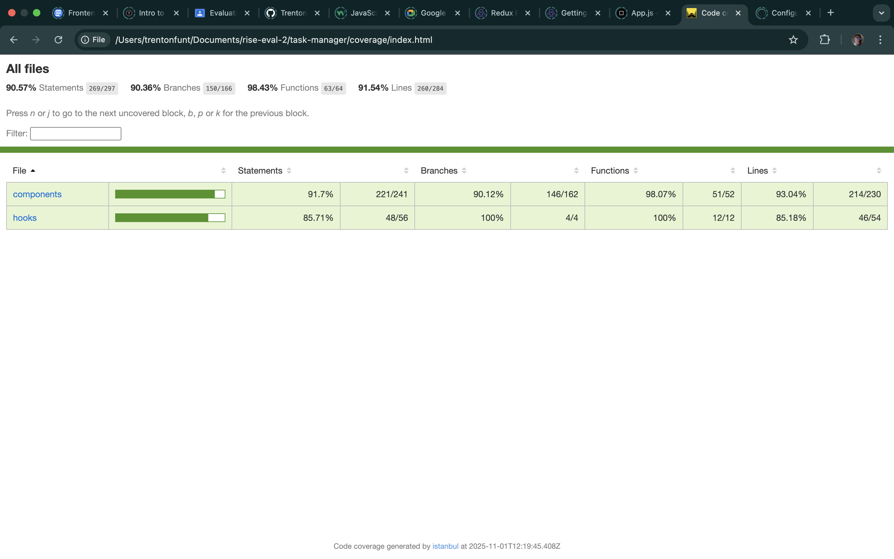
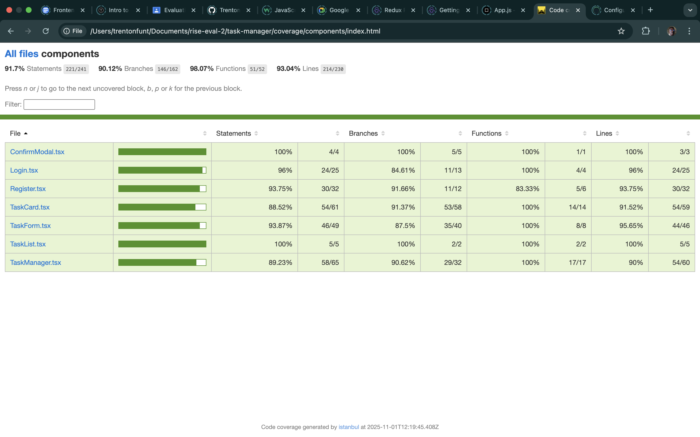
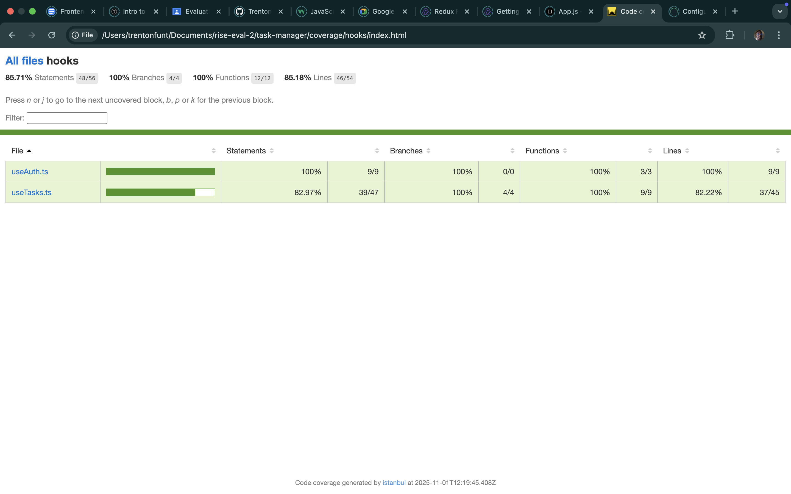

# Task Manager

A modern, full-featured task management application built with React, TypeScript, and Firebase. This project demonstrates comprehensive testing practices including unit tests (90.57% coverage) and end-to-end tests (44 tests, 100% passing) using Vitest and Cypress.

## 📸 Screenshots

### Unit Testing

*54 unit tests passing with 90.57% code coverage*


*React component tests using Vitest and React Testing Library*


*Custom React hooks tests for authentication and task management*

### E2E Testing

*Cypress E2E test: Task management dashboard with filters and search*


*Cypress E2E test: Creating and editing tasks with real-time updates*


*Cypress E2E test: Task filtering functionality*

## ✨ Features

### Core Functionality
- 🔐 **User Authentication** - Secure registration and login with Firebase Auth
- ✅ **Task CRUD Operations** - Create, read, update, and delete tasks
- 🏷️ **Categorization** - Organize tasks by category (Work, Personal, Shopping, etc.)
- 🎯 **Priority Levels** - Set task priorities (Low, Medium, High)
- 📅 **Due Dates** - Track deadlines for tasks
- ✔️ **Completion Tracking** - Mark tasks as complete or incomplete
- 🔍 **Advanced Filtering** - Filter by category, priority, and status
- 🔎 **Search Functionality** - Find tasks quickly by title or description
- 💾 **Real-time Sync** - Automatic updates with Firestore

### User Experience
- 📱 **Responsive Design** - Works seamlessly on desktop, tablet, and mobile
- ♿ **Accessibility** - ARIA labels, semantic HTML, keyboard navigation
- 🎨 **Modern UI** - Clean interface with Tailwind CSS
- 🔔 **Notifications** - Visual feedback for all actions
- ⚡ **Fast Performance** - Optimized React with Vite build tool

### Quality Assurance
- ✅ **90.57% Unit Test Coverage** - Comprehensive component and hook tests
- 🧪 **54 Passing Unit Tests** - Vitest + React Testing Library
- 🎭 **44 Passing E2E Tests** - Cypress with real Firebase integration
- 📸 **Automatic Screenshots** - Visual test artifacts for debugging
- 🎥 **Video Recording** - Complete test run recordings

## 🛠️ Tech Stack

### Frontend
- **React 19** - Modern UI library with latest features
- **TypeScript** - Type-safe development
- **Vite** - Fast build tool and dev server
- **Tailwind CSS 4** - Utility-first styling
- **React Router 7** - Client-side routing

### Backend & Services
- **Firebase Authentication** - Secure user authentication
- **Cloud Firestore** - Real-time NoSQL database
- **Firebase SDK 12** - Latest Firebase features

### Testing
- **Vitest 4** - Fast unit test runner
- **React Testing Library 16** - Component testing utilities
- **Cypress 15** - End-to-end testing framework
- **@vitest/coverage-v8** - Code coverage reporting
- **start-server-and-test** - E2E test orchestration

### Code Quality
- **ESLint 9** - Code linting
- **Prettier** - Code formatting
- **TypeScript ESLint** - TypeScript-specific linting rules

## 📋 Prerequisites

- **Node.js** 18.x or higher
- **npm** 9.x or higher
- **Firebase Account** (free tier works)

## 🚀 Getting Started

### 1. Clone the Repository

```bash
git clone https://github.com/TrentonFunt/task-manager.git
cd task-manager
```

### 2. Install Dependencies

```bash
npm install
```

### 3. Firebase Setup

1. Create a new Firebase project at [Firebase Console](https://console.firebase.google.com/)
2. Enable **Authentication** (Email/Password provider)
3. Create a **Firestore Database** (start in test mode or configure rules)
4. Get your Firebase configuration from Project Settings

### 4. Environment Configuration

Create a `.env` file in the project root:

```env
VITE_FIREBASE_API_KEY=your_api_key_here
VITE_FIREBASE_AUTH_DOMAIN=your_project.firebaseapp.com
VITE_FIREBASE_PROJECT_ID=your_project_id
VITE_FIREBASE_STORAGE_BUCKET=your_project.appspot.com
VITE_FIREBASE_MESSAGING_SENDER_ID=your_sender_id
VITE_FIREBASE_APP_ID=your_app_id
```

> ⚠️ **Important**: Never commit your `.env` file. Use `.env.example` as a template.

### 5. Firestore Security Rules (Optional)

Deploy these rules to your Firestore database:

```javascript
rules_version = '2';
service cloud.firestore {
  match /databases/{database}/documents {
    match /tasks/{taskId} {
      allow read, write: if request.auth != null && 
                            request.auth.uid == resource.data.userId;
      allow create: if request.auth != null;
    }
  }
}
```

### 6. Run the Application

```bash
npm run dev
```

Open [http://localhost:5173](http://localhost:5173) in your browser.

## 📜 Available Scripts

### Development

```bash
npm run dev          # Start development server (http://localhost:5173)
npm run build        # Build for production
npm run preview      # Preview production build locally
npm run lint         # Run ESLint
```

### Testing

```bash
# Unit Tests
npm test             # Run unit tests in watch mode
npm run test:ui      # Open Vitest UI (interactive test runner)
npm run test:coverage # Generate coverage report

# E2E Tests
npm run test:e2e         # Run Cypress tests headless
npm run test:e2e:open    # Open Cypress test runner (interactive)
npm run cypress:open     # Open Cypress directly (requires dev server)
npm run cypress:run      # Run Cypress headless (requires dev server)
```

## 🧪 Testing Strategy

This project demonstrates comprehensive testing practices with both unit and end-to-end tests, achieving **90.57% code coverage** and **100% test pass rate**.

### Unit Testing (90.57% Coverage)

**Framework**: Vitest 4 + React Testing Library 16

**Test Suite**: 9 test files, 54 passing tests

**Coverage by File**:
```
File               | Stmts  | Branch | Funcs  | Lines
-------------------|--------|--------|--------|--------
All files          | 90.57% | 90.36% | 98.43% | 91.54%
components/        | 91.70% | 90.12% | 98.07% | 93.04%
  ConfirmModal.tsx | 100%   | 100%   | 100%   | 100%
  Login.tsx        | 96%    | 84.61% | 100%   | 96%
  Register.tsx     | 93.75% | 91.66% | 83.33% | 93.75%
  TaskCard.tsx     | 88.52% | 91.37% | 100%   | 91.52%
  TaskForm.tsx     | 93.87% | 87.5%  | 100%   | 95.65%
  TaskList.tsx     | 100%   | 100%   | 100%   | 100%
  TaskManager.tsx  | 89.23% | 90.62% | 100%   | 90%
hooks/             | 85.71% | 100%   | 100%   | 85.18%
  useAuth.ts       | 100%   | 100%   | 100%   | 100%
  useTasks.ts      | 82.97% | 100%   | 100%   | 82.22%
```

**Testing Approach**:
- **User-Centric Testing**: Focus on user behavior, not implementation details
- **Mocking Strategy**: Mock external dependencies (Firebase Auth, Firestore)
- **Accessibility Testing**: Verify ARIA labels and semantic HTML
- **Error Scenarios**: Test both success and failure paths
- **Type Safety**: Full TypeScript coverage in tests

**What We Test**:
- Component rendering and user interactions
- Form validation (client-side and Firebase errors)
- Error handling and loading states
- State management and prop updates
- Custom hooks with mocked Firebase APIs
- Accessibility attributes and keyboard navigation
- User event simulations (typing, clicking, form submission)

**View Coverage Report**:
```bash
npm run test:coverage -- --run
open coverage/index.html  # Opens interactive HTML report
```

### End-to-End Testing (100% Pass Rate)

**Framework**: Cypress 15 with TypeScript

**Test Suite**: 3 spec files, 44 passing tests

**Testing Approach**:
- **Real Firebase Integration**: No mocks - tests against actual Firebase backend
- **Stable Selectors**: Element IDs, ARIA labels, semantic roles (no brittle CSS classes)
- **Synchronization**: Explicit waits for Firebase real-time updates
- **Visual Artifacts**: Automatic screenshot after each test + video per spec
- **Custom Commands**: Reusable `cy.login()` and `cy.register()` helpers

**Test Coverage**:

1. **Authentication Flow** (`auth.cy.ts` - 13 tests)
   - Registration with validation (password mismatch, weak password, required fields)
   - Login with error handling (invalid credentials, rate limiting)
   - Logout with confirmation modal (confirm/cancel flows)
   - Protected route guards (redirect unauthenticated users)
   - Navigation between auth pages

2. **Task Management** (`tasks.cy.ts` - 14 tests)
   - **Create**: Form validation, required fields, success with notifications
   - **Read**: Empty state display, multi-item rendering, task list visibility
   - **Update**: Inline editing, save changes, cancel without saving
   - **Delete**: Confirmation modal, successful deletion, cancel protection
   - **Toggle**: Mark complete/incomplete with UI state updates
   - **Cancellation**: Form cancel flows without data persistence

3. **Filtering & Search** (`filters.cy.ts` - 17 tests)
   - **Category Filters**: All Categories, Personal, Work, Shopping
   - **Priority Filters**: All Priorities, Low, Medium, High
   - **Status Filters**: All Tasks, Active, Completed
   - **Search**: Case-insensitive keyword search by title/description
   - **Combined Filters**: Multiple simultaneous filters (category + priority + search)
   - **Empty States**: No results messaging when filters match nothing

**E2E Test Features**:
- ✅ **Real Firebase**: Actual Auth + Firestore (validates production behavior)
- ✅ **Automatic Screenshots**: 44 full-page PNGs (one per test) in `cypress/screenshots/`
- ✅ **Video Recording**: 3 MP4 videos (one per spec) in `cypress/videos/`
- ✅ **Robust Selectors**: IDs (`#task-title`), ARIA labels, roles (`[role="dialog"]`)
- ✅ **Custom Commands**: `cy.login()`, `cy.register()` for common flows
- ✅ **Stable Suite**: No flaky tests - 100% pass rate across runs
- ✅ **Duration**: ~12 minutes (includes real Firebase sync delays)

**View Test Artifacts**:
```bash
# Screenshots (44 full-page captures)
open cypress/screenshots/

# Videos (3 spec recordings)
open cypress/videos/
```

**Test Stability Techniques**:
- Explicit waits for Firestore `onSnapshot` sync (`cy.wait(2000)`)
- Wait for form visibility before interaction (`cy.get('#form').should('be.visible')`)
- Clear inputs before typing (`cy.get('#input').clear().type('text')`)
- Wait for form closure after submit (`cy.get('form').should('not.exist')`)
- Use `{ delay: 0 }` on type commands for speed and reliability

## 📁 Project Structure

```
task-manager/
├── src/
│   ├── components/          # React components
│   │   ├── ConfirmModal.tsx  # Reusable confirmation dialog
│   │   ├── Login.tsx         # Login page
│   │   ├── Register.tsx      # Registration page
│   │   ├── ProtectedRoute.tsx # Route guard
│   │   ├── TaskCard.tsx      # Individual task display/edit
│   │   ├── TaskForm.tsx      # Task creation form
│   │   ├── TaskList.tsx      # Task list container
│   │   └── TaskManager.tsx   # Main dashboard
│   ├── hooks/               # Custom React hooks
│   │   ├── useAuth.ts        # Authentication state
│   │   └── useTasks.ts       # Task CRUD operations
│   ├── firebase/            # Firebase configuration
│   │   └── config.ts         # Firebase initialization
│   ├── types/               # TypeScript type definitions
│   │   └── index.ts          # Task and notification types
│   ├── __tests__/           # Unit test files
│   │   ├── *.test.tsx        # Component tests
│   │   └── *.test.ts         # Hook tests
│   ├── App.tsx              # Root component with routing
│   └── main.tsx             # Application entry point
├── cypress/                 # E2E tests
│   ├── e2e/                 # Test specs
│   │   ├── auth.cy.ts        # Authentication tests
│   │   ├── tasks.cy.ts       # Task management tests
│   │   └── filters.cy.ts     # Filter/search tests
│   ├── support/             # Cypress support files
│   │   ├── commands.ts       # Custom commands
│   │   ├── e2e.ts            # Global hooks
│   │   └── index.d.ts        # TypeScript definitions
│   ├── screenshots/         # Test screenshots
│   └── videos/              # Test recordings
├── coverage/                # Coverage reports (generated)
├── public/                  # Static assets
├── cypress.config.ts        # Cypress configuration
├── vite.config.ts           # Vite + Vitest configuration
├── tsconfig.json            # TypeScript configuration
├── tailwind.config.js       # Tailwind CSS configuration
└── package.json             # Dependencies and scripts
```

## 🎯 Key Features Explained

### Real-time Synchronization

Tasks automatically sync across all devices using Firestore's `onSnapshot` listener:

```typescript
// Automatic real-time updates
const unsubscribe = onSnapshot(q, (snapshot) => {
  const tasksData = snapshot.docs.map(doc => ({
    id: doc.id,
    ...doc.data()
  }));
  setTasks(tasksData);
});
```

### Advanced Filtering

Combine multiple filters and search:

```typescript
// Filter by category, priority, status, AND search text
const filteredTasks = tasks
  .filter(task => categoryFilter === 'all' || task.category === categoryFilter)
  .filter(task => priorityFilter === 'all' || task.priority === priorityFilter)
  .filter(task => filter === 'all' || 
    (filter === 'active' && !task.completed) || 
    (filter === 'completed' && task.completed))
  .filter(task => 
    task.title.toLowerCase().includes(searchQuery.toLowerCase()) ||
    task.description.toLowerCase().includes(searchQuery.toLowerCase())
  );
```

### Accessibility Features

- **Semantic HTML**: Proper heading hierarchy, landmarks, and roles
- **ARIA Labels**: Descriptive labels for screen readers
- **Keyboard Navigation**: Full keyboard support
- **Focus Management**: Logical tab order
- **Color Contrast**: WCAG AA compliant

Example:
```tsx
<form aria-label="New task form" role="form">
  <input 
    id="task-title"
    aria-label="Task title"
    aria-required="true"
  />
</form>
```

## 🐛 Troubleshooting

### Firebase Connection Issues

**Problem**: "Firebase: Error (auth/...)" messages

**Solution**:
1. Verify your `.env` file has correct Firebase credentials
2. Check Firebase Console that Authentication is enabled
3. Ensure Firestore database is created
4. Review Firestore security rules

### Test Failures

**Unit Tests**:
```bash
# Clear cache and reinstall
rm -rf node_modules coverage
npm install
npm test
```

**E2E Tests**:
```bash
# Ensure dev server is running
npm run dev  # In separate terminal

# Clear Cypress cache
npx cypress cache clear
npx cypress install

# Run tests
npm run test:e2e
```

### Port Already in Use

If port 5173 is taken:
```bash
# Find and kill process
lsof -ti:5173 | xargs kill -9

# Or use a different port
npx vite --port 3000
```

## 🤝 Contributing

This is an educational project demonstrating testing best practices. While not accepting external contributions, feel free to fork and adapt for your own learning!

## 📝 License

This project is part of a technical assessment and is provided as-is for educational purposes.

## 👨‍💻 Author

**Trenton Funt**
- GitHub: [@TrentonFunt](https://github.com/TrentonFunt)

## 🙏 Acknowledgments

- React team for an amazing library
- Firebase for backend infrastructure
- Vitest and Cypress teams for excellent testing tools
- Tailwind CSS for rapid styling

---

## 📊 Project Stats

- **Lines of Code**: ~3,500+
- **Components**: 7
- **Custom Hooks**: 2
- **Unit Tests**: 54
- **E2E Tests**: 44
- **Coverage**: 90.57%
- **Build Time**: ~5s
- **Test Suite Runtime**: ~23 minutes (unit + e2e)

## 🔗 Links

- **Repository**: https://github.com/TrentonFunt/task-manager
- **Documentation**: See `TESTING_DEVELOPMENT_LOG.md` for detailed testing journey

---

**Built with ❤️ using React, TypeScript, and Firebase**
